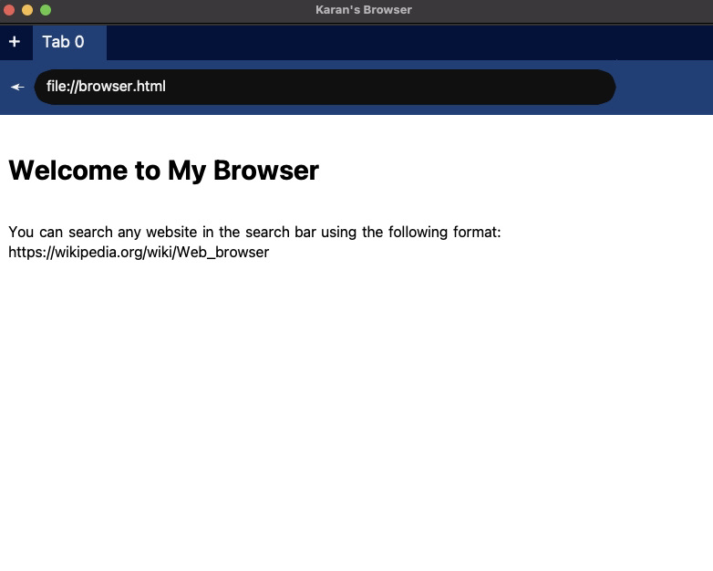

# Browser

This repo contains code for a browser I wrote in Python. This code handles everything from graphics to networking, parsing, javascript, DOM events and even features like hsl, cookies and logins.

You can start the browser by cloning the repo and using the command:

``` $ python3 browser.py ```

Once you execute the above command, the following window will open up:



If you want to learn how browsers work in detail, I highly recommend [this book](https://browser.engineering/)
